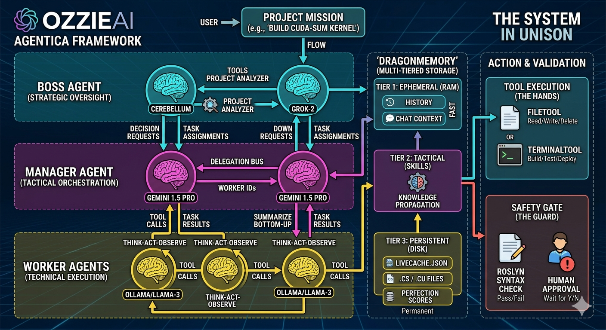
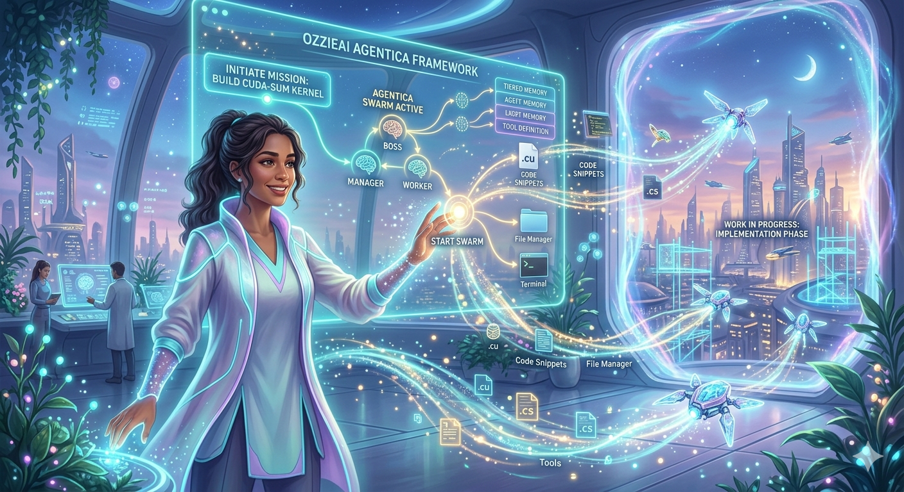

# 🤝 Contributing to Agentica

Thank you for considering contributing to the OzzieAI Agentica Framework! To maintain the integrity of the "Unison" protocol, please follow these guidelines. Join our discussions at the [OzzieAI Forum](https://forum.ozzieai.com).

## 🛠 Development Workflow

### 1. The Environment
Agentica is built on .NET 8.0. You will need the latest SDK and a local LLM runner (like Ollama) or API keys for Grok/Gemini to test agentic reasoning.


### 2. Creating New Tools
The most common way to contribute is by adding new `IAgentTool` implementations. Tools must follow the contract to ensure the LLM can understand the arguments and requirements:

```C#
public class MyNewTool : IAgentTool 
{
    public string Name => "custom_tool";
    public string Description => "Explain clearly so the LLM knows when to call it.";
    public object GetToolDefinition() => /* JSON Schema for parameters */;
    public async Task<string> ExecuteAsync(string jsonArguments) => /* Execution logic */;
}
```



### 3. Memory Integrity
When modifying the `BaseAgent` or `DragonMemory`, you must ensure that **Upstream Propagation** remains functional. A Worker's discovery MUST bubble up to the Boss through the Manager.



## 📜 Coding Standards
- **Asynchronous Flow:** Use `Task` or `ValueTask` for all IO and inter-agent communication.
- **Immutability:** Use `records` for message types and state snapshots.
- **Documentation:** Every public class and tool must have XML documentation tags for the LLM to parse.

## 📫 How to Submit
1. Fork the repository and create your feature branch.
2. Ensure all `CodeSafetyGate` tests pass and the terminal executor handles errors gracefully.
3. Submit a Pull Request with a detailed description of the new capability.

---

## 🌐 Support
For technical questions or to report bugs, please use:
* **Support Portal:** [ozzieai.com](https://www.ozzieai.com)
* **Developer Forum:** [forum.ozzieai.com](https://forum.ozzieai.com)