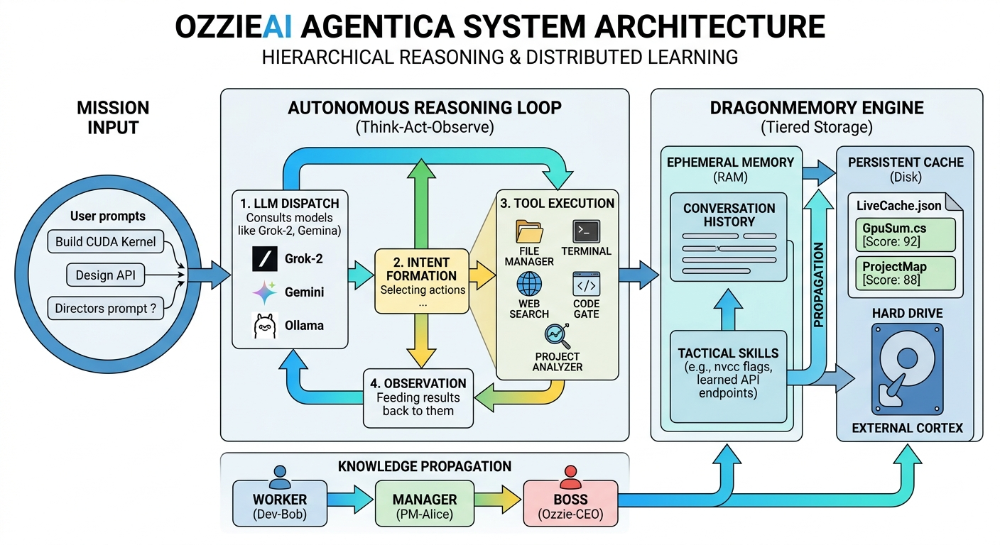
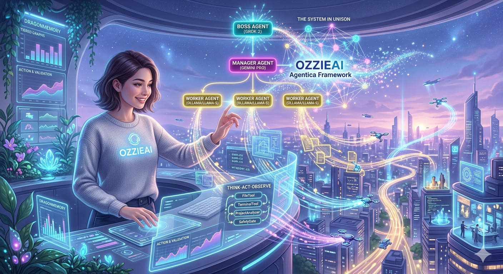
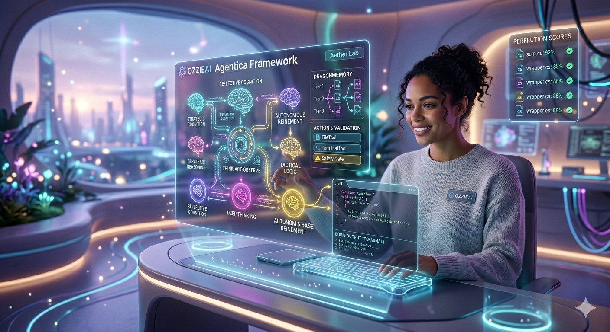

# 🚀 OzzieAI Agentica: The Autonomous Swarm Framework

**OzzieAI Agentica** is an industrial-grade, multi-agent orchestration framework designed for high-autonomy project execution. Moving beyond simple "chatbots," Agentica creates a digital organism—a hierarchical swarm of independent "brains" that communicate via an asynchronous bus to research, architect, code, and verify complex software systems.

For the latest updates, official source code, and enterprise support, visit [OzzieAI Official](https://www.ozzieai.com) or join the community at the [OzzieAI Forum](https://forum.ozzieai.com).

---

## 🏗️ I. The Philosophy: The "Unison" Protocol

Traditional AI agents often suffer from "Context Drift" and "Reasoning Bottlenecks." Agentica solves this through the **Unison Protocol**, which divides labor based on cognitive complexity.

### 1. The Hierarchical Swarm
To ensure high-fidelity execution, we divide responsibilities into three distinct tiers:
* **Boss Agent (The Architect):** Uses high-reasoning models (e.g., Grok-2, Gemini 1.5 Pro) to define the mission, validate ethical constraints, and perform final code reviews.
* **Manager Agent (The Orchestrator):** Breaks down the Boss's vision into a sequence of technical tasks. It manages the lifecycle of Worker agents and synthesizes their technical reports.
* **Worker Agent (The Engine):** Executes low-level technical tasks (coding, searching, compiling). Optimized for fast, specialized models (e.g., Ollama/Llama-3-Coder) to ensure rapid iteration.



### 2. Cognitive Diversity (Multi-Brain Support)
Unlike single-model systems, Agentica allows every agent to have its own unique LLM provider. You can run a "Premium" brain for the Boss and "Local/Open-Source" brains for Workers to balance cost, privacy, and performance.

---

## 🧠 II. DragonMemory™: The Multi-Tiered Neural Core

Agentica uses a proprietary memory architecture called **DragonMemory**, which mimics human cognitive layers to ensure that agents learn from their mistakes and remember their successes.

### 1. Tier 1: Ephemeral Memory (The "Conscious" Stream)
Stored in the agent's active `History`, this represents the immediate task context. It is a sliding-window memory that ensures the agent remains focused on the current objective without being overwhelmed by past noise.

### 2. Tier 2: Tactical Memory (Skill & Fact Propagation)
When a Worker discovers a specific solution (e.g., "The correct MSBuild flag for a C++ DLL"), it triggers the `LearnSkill` method. Through **Upstream Propagation**, this fact "bubbles up" to the Manager and Boss, ensuring the entire swarm "knows" what the Worker has learned without manual re-briefing.

### 3. Tier 3: Persistent Memory (The Hardened "Cortex")
Powered by the `LiveCache` engine, this layer hardens knowledge to the physical disk. Every file generated is assigned a **Perfection Score (0-100)**. 
* **Integrity:** Files are only saved if they pass the `CodeSafetyGate`.
* **Persistence:** Knowledge survives system reboots by serializing into `LiveCache.json`.



---

## ⚙️ III. The Cognitive Execution Loop

Every agent operates in a non-blocking, recursive **Think-Act-Observe** cycle. This loop allows the agent to self-correct in real-time.

1.  **Ingestion:** The agent receives a mission via the `AgentBus`.
2.  **Deliberation (Think):** The agent analyzes the project structure using the `ProjectAnalyzerTool`.
3.  **Execution (Act):** The agent selects and runs a tool (e.g., writing a file via `FileToolExecutor`).
4.  **Verification (Observe):** The result of the action (success or error) is fed back into memory. If a build fails, the agent automatically interprets the error and attempts a fix.



---

## 🛠️ IV. Built-in Tooling (The Hands)

Agentica agents come pre-equipped with a suite of professional tools:
* **FileToolExecutor:** High-speed I/O for reading, writing, and listing files.
* **TerminalTool:** Provides agents with shell access (`cmd.exe` or `bash`) to run compilers or git commands.
* **CodeSafetyGateTool:** A Roslyn-powered validator that checks syntax before persistence.
* **ProjectAnalyzerTool:** Generates a recursive map of the codebase for high-level context.
* **WebSearchTool:** Grants agents real-time access to documentation and troubleshooting data.

---

## 🚀 V. Advanced Implementation (Multi-Brain Setup)

One of Agentica's greatest strengths is its ability to assign different LLM providers to different roles.

```C#

        // EV Names:
        string GeminiEVName = "Gemini_API_KEY";
        string GrokEVName = "Grok_API_KEY";

        // Get API Keys
        var geminiKey = Environment.GetEnvironmentVariable(GeminiEVName) ?? throw new Exception($"{GeminiEVName} not set in environment variables.");
        var grokKey = Environment.GetEnvironmentVariable(GrokEVName) ?? throw new Exception($"{GrokEVName} not set in environment variables.");

        Console.Title = "OzzieAI Agentica Framework";
        ConsoleLogger.WriteLine("🤖 Initializing Agentica Swarm...", ConsoleColor.Red);

        // Infrastructure Setup
        string projectPath = Path.Combine(Directory.GetCurrentDirectory(), "Workspace");

        // 1. Initialize different providers
        var bus = new AgentBus();
        var liveCache = new LiveCache(projectPath);

        // All available brains (Boss chooses the best one for each role)
        var brains = new Dictionary<string, ILlmProvider>
        {
            { "grok",   new GrokProvider(grokKey, model: "grok-4-1-fast-reasoning") },
            { "gemini", new GeminiProvider(geminiKey, model: "gemini-flash-latest") },
            { "ollama", new OllamaProvider(model: "gemma4:e2b") }
        };

        // Init the Boss:
        string BossName = "Ozzie-CEO";
        var bossConfig = new AgentConfig 
        {
            Name = BossName,
            Provider = new OllamaProvider("gemma4:e4b")
        };
        DragonMemory bossMemory = new DragonMemory(bossConfig.Id);
        bossMemory.AttachPersistentCache(liveCache);

        // Always use AgentFactory to create Boss, Manager and Worker Agents:
        AgentFactory factory = new AgentFactory(bus, liveCache);
        BossAgent boss = factory.CreateBoss(bossConfig, brains);

        // Give the Boss ONE mission — it does everything else automatically
        string mission = "Research best practices for a C# 64-bit sum implementation, create the file, and verify it with a terminal build command.";

        await boss.ExecuteHighLevelMissionAsync(mission);

        // Keep the app alive
        await Task.Delay(Timeout.Infinite);
        
```

---

## 🌐 Contact & Support
* **Official Website:** [ozzieai.com](https://www.ozzieai.com)
* **Developer Forum:** [forum.ozzieai.com](https://forum.ozzieai.com)